# 🚀 EasyServe

### 👨‍💻 Done By: Rula Hisham (https://github.com/Rula-Sh)

## 📚 Project Description
**Customer Appointment Management System (CAMS)** allows:
- **Customers** to book, view, and track appointments.
- **Employees** to create services and manage appointments (approve/reject/complete).
- **Admins** to manage users, services, with full system access via the dashboard.

## 🌐 Technologies Used

### 🧠 Backend
- ASP.NET Core
- Entity Framework Core
- ASP.NET Identity (Authentication & Authorization)
- **3-Tier Architecture** (Presentation, Business Logic, Data Access)
- **DTOs (Data Transfer Objects)** – For secure and structured data exchange
- **Interface-based Services** - For abstraction and testability
- AutoMapper – For object-object mapping
- SignalR – For real-time communication

### 🗄️ Database
- SQL Server (via SQL Server Management Studio)

### 🎨 Frontend
- Bootstrap / Bootstrap Icons / Bootstrap DatePicker
- TimePicker
- jQuery / jQuery AJAX
- DataTables – Dynamic tables with sorting and pagination
- Chart.js – Data visualization
- Toastr – Toast notifications

## 🚦 Setup Instructions
````
# 📦 Intstall Tools
dotnet tool install --global dotnet-ef

# 🔧 Uninstall tools
dotnet tool uninstall --global dotnet-ef

# 📦 Add Packages
dotnet add package AutoMapper
dotnet add package Microsoft.EntityFrameworkCore 
dotnet add package Microsoft.EntityFrameworkCore.Tools
dotnet add package Microsoft.EntityFrameworkCore.Design
dotnet add package Microsoft.Extensions.Identity.Stores
dotnet add package Microsoft.Extensions.Configuration.Json
dotnet add package Microsoft.EntityFrameworkCore.SqlServer
dotnet add package Microsoft.AspNetCore.Identity.EntityFrameworkCore

# 🗑️ Remove Packages
dotnet package remove <PackageName>

# 🗄️ Initialize or Update the Database
add-migration <MigrationName>
remove-migration
update-database

# 🚀 Build, Run, and Watch the Project
dotnet build
dotnet run
dotnet watch

````

## 📁 Folder Structure
- CAMS.Web/ : ViewModels, Views, Controllers, ViewModelMapper, SignalR
- CAMS.Application/ : Interfaces, Services, DTOs, Helpers (includes AutoMapper)
- CAMS.Data/ : Models, Configurations, SeedingData, Migrations

## 🔐 Role-Based Access
- **Admin**
  - Full access to manage users, services, and appointments
  - Employee privileges
  - System dashboard and notifications
- **Employee**
  - CRUD operations on services
  - Approve, reject, and complete appointments
  - Notifications on customer actions
- **Customer**
  - Book appointments by selecting date/time for desired services
  - View and cancel appointments

## 📸 Screenshots

## 🏠 Home Page

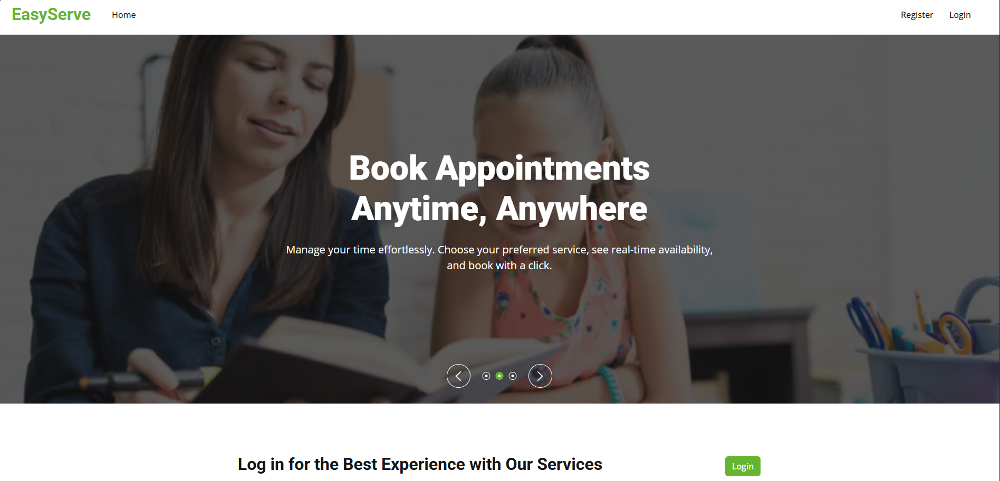

## 👑 Admin 

### 📊 Dashboard (Home Page)
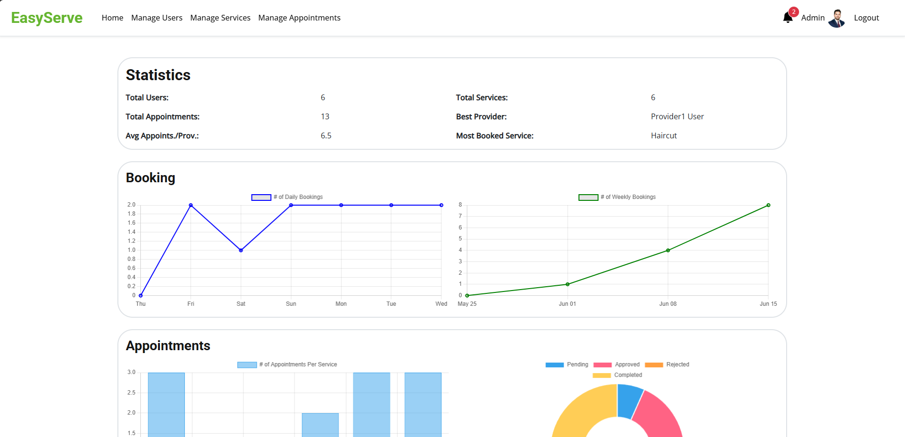
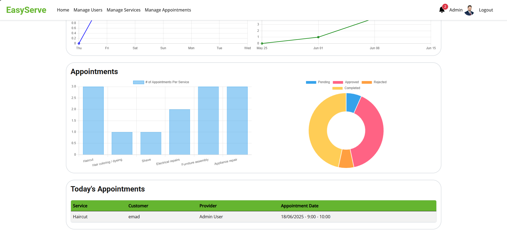

### 👥 Manage Users
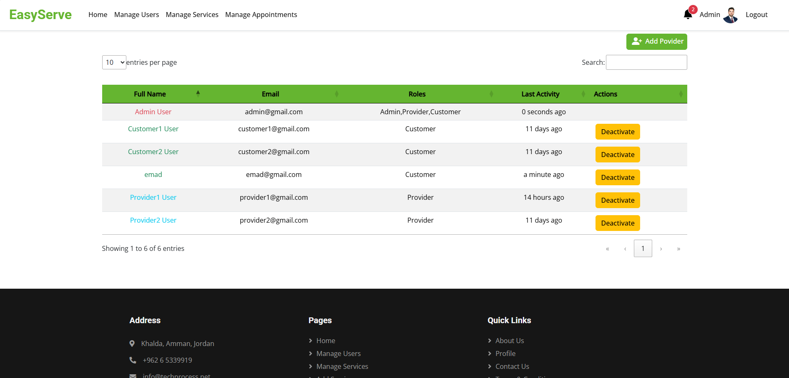

### 👤 Profile
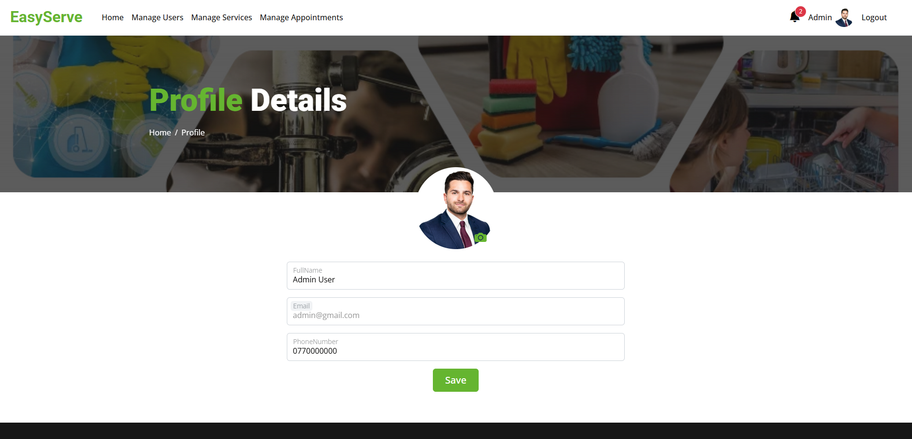

## 👨‍💼 Provider 

### 📅 Appointments (Home Page)
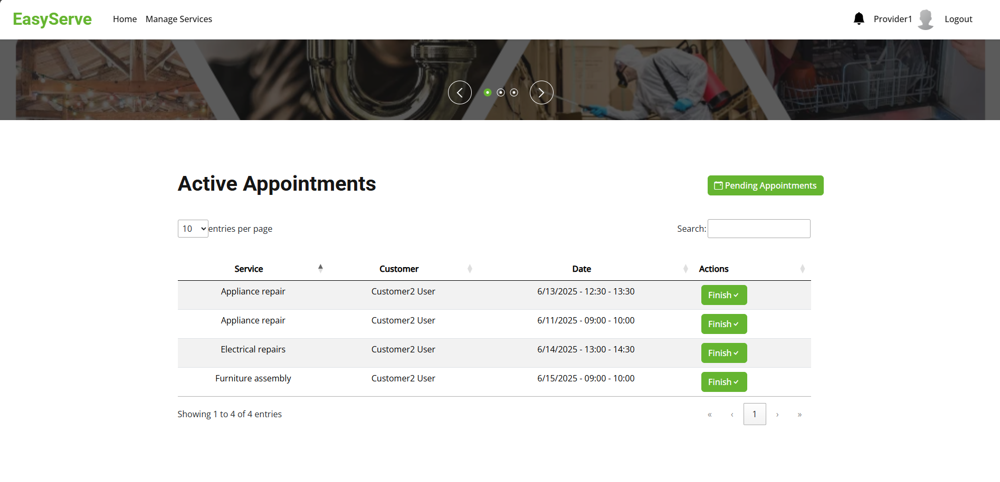

### 🕓 Pending Appointments
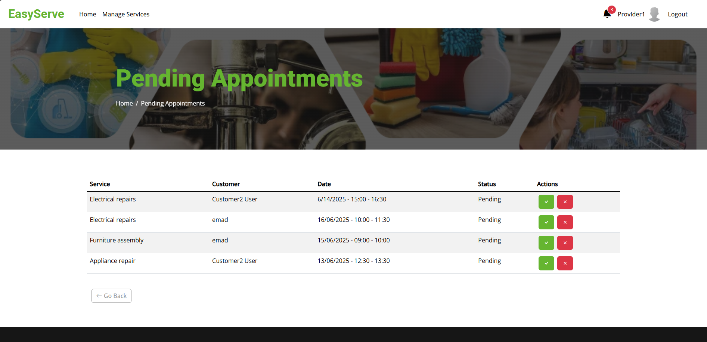

### 🛎️ Manage Services
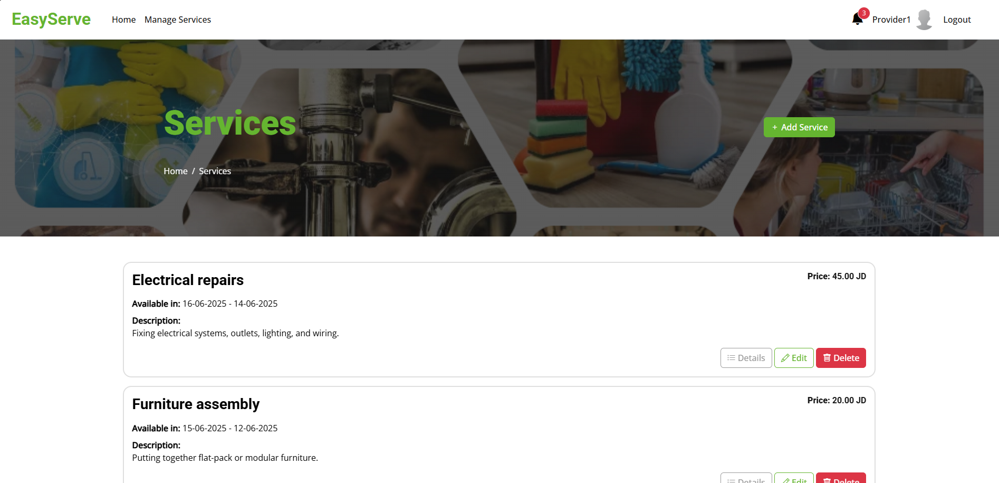

### 🖋️ Edit Service
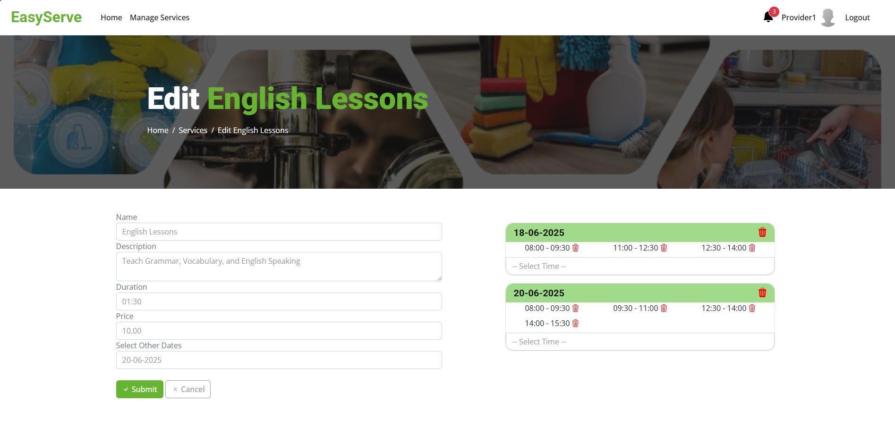

### 📋 Service Details
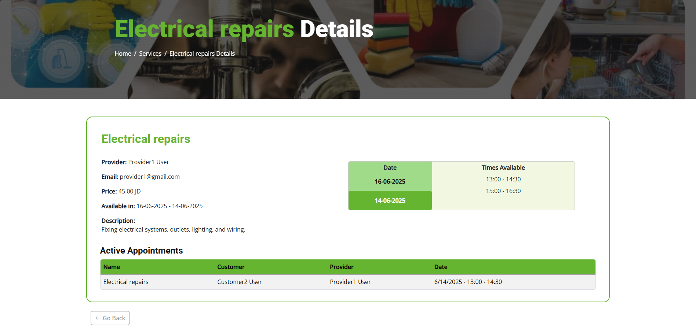

## 🙍🏻‍♂️ Customer 

### 📅 Appointments (Home Page)
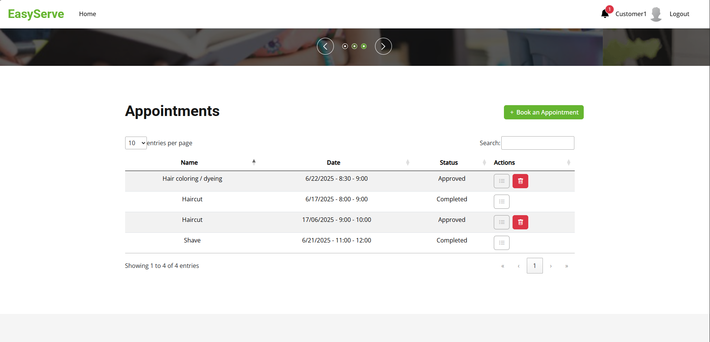

### 📝 Book Appointment
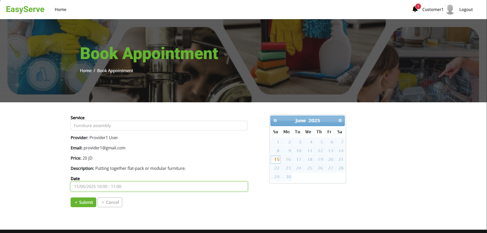

### 📋 Appointment Details
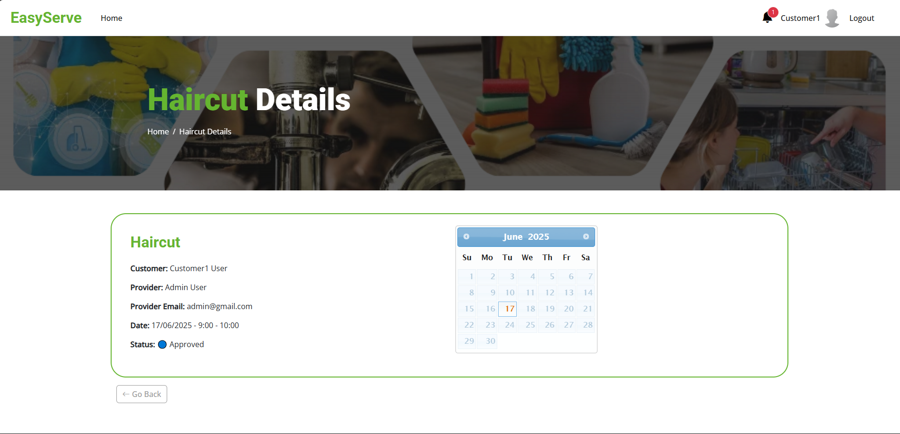


## ✅ Features Checklist
 - Customer booking
 - Role-based access control
 - Real-time updates with SignalR
 - Admin dashboard
 - Notification system
 - Data visualization with Chart.js
 - Secure data handling using DTOs


## 🧪 Testing Steps
- Seed Default Roles, Admin User, and Services
- Test Authentication (Admin/Employee/Customer)
- Test Appointment Booking Flow (Customer)
- Test Appointment Management (Employee/Admin)
- Test Service Management (Employee/Admin)
- Test Dashboard and Charts (Admin)
- Test Notifications
- Test Frontend Validations
